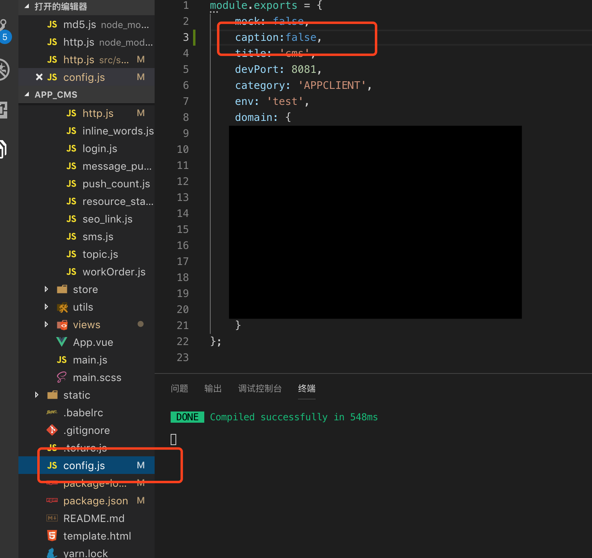
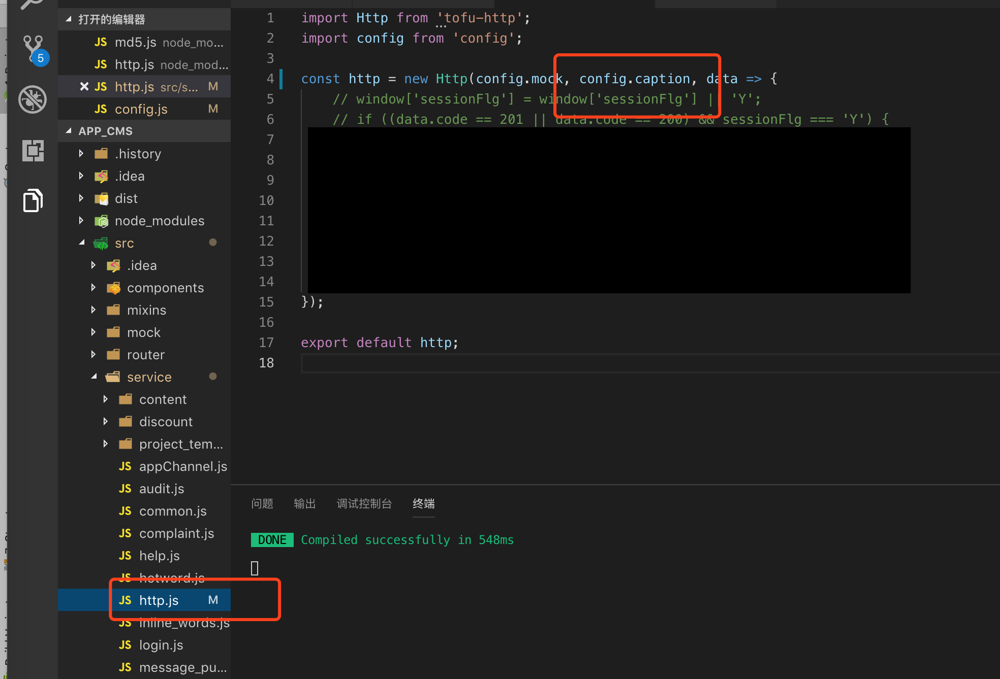

# tofu-http

## Install
```shell
npm install tofu-http
```

## Example
``` javascript
import http from 'tofu-http';
const params = {
    id:1
}
http.$get('http://github.com',params).then(res => {
    //do something...
});
```

## attention
#### 由于接口加密, 需要在项目中配置默认值
1. 在项目根目录 `config.js` 文件中, 添加 `caption:false` (false, 代表本项目不加密，true 代表加密)；
2. 在项目根目录下 `src/service` 的 `http.js` 文件中，添加 `config.caption` 例如：`const http = new Http(config.mock, config.caption, data => ....`

